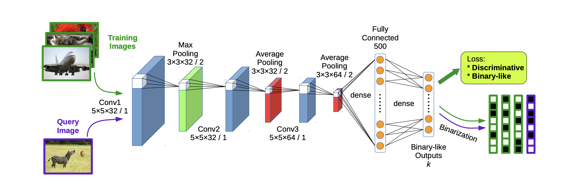

# Deep Supervised Hashing

This is a [pyTorch](https://pytorch.org/) implementation of paper: [Liu et al. - Deep Supervised Hashing for Fast Image Retrieval (CVPR 2016)](https://www.cv-foundation.org/openaccess/content_cvpr_2016/papers/Liu_Deep_Supervised_Hashing_CVPR_2016_paper.pdf)

## Requirements
- python >=3.6
- pytorch >=1.1 (must havetensorboard included)

## Model

## Loss Function

- The loss function is the pairwise ranking loss function with _margin_ and _regularization_ 
(There is a nice [blog post](https://gombru.github.io/2019/04/03/ranking_loss/) about the description of various loss functions).
- The pairwise loss function forces the distance of similar pairs to be small, 
and that of dissimilar pairs to be large, with a margin so that the model does not leverage on dissimilar pairs.
- The third term, the regularization term, leads the output binary-like vectors' elements have absolute values close to 1 
(an L1 loss with `ones` tensor).
- Large `alpha` value introduces more penalty if vector's elements are not close to 1.

## Experiments
