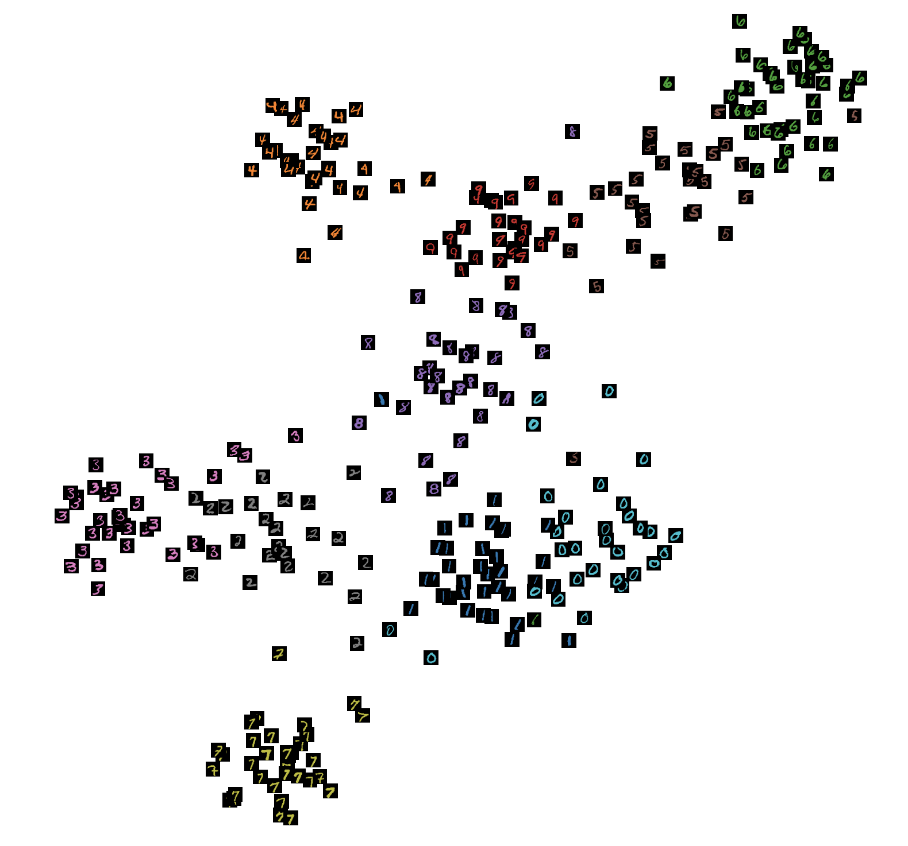
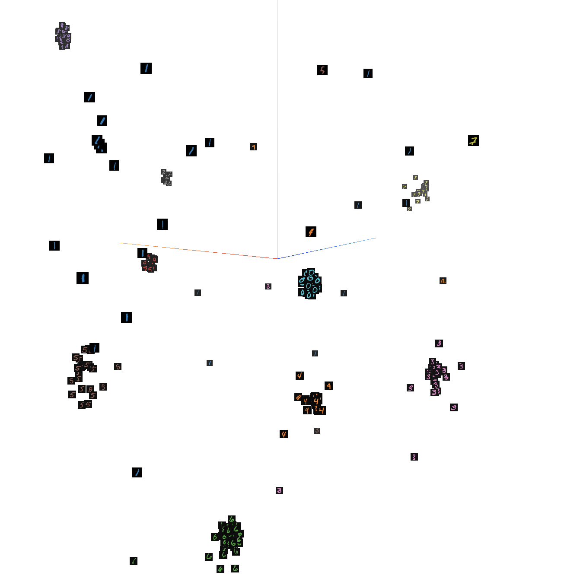

# Deep Supervised Hashing

This is a [pyTorch](https://pytorch.org/) implementation of paper: [Liu et al. - Deep Supervised Hashing for Fast Image Retrieval (CVPR 2016)](https://www.cv-foundation.org/openaccess/content_cvpr_2016/papers/Liu_Deep_Supervised_Hashing_CVPR_2016_paper.pdf)

## Requirements
- python >=3.6
- pytorch >=1.1 (must havetensorboard included)

## Model

- Uses a simple CNN layer, but in this repository the model is a small ResNet.
- Accepts the number of bits it should encode the hash into.

## Loss Function


- The loss function is the pairwise ranking loss function with _margin_ and _regularization_ 
(There is a nice [blog post](https://gombru.github.io/2019/04/03/ranking_loss/) about the description of various loss functions).
- The pairwise loss function forces the distance of similar pairs to be small, 
and that of dissimilar pairs to be large, with a margin so that the model does not leverage on dissimilar pairs.
- The third term, the regularization term, leads the output binary-like vectors' elements have absolute values close to 1 
(an L1 loss with `ones` tensor).
- Large `alpha` value introduces more penalty if vector's elements are not close to 1.

## Experiments
- The experiment is done with **MNIST** dataset, and the model is told to encode the class of the image in **8** bits (which can hold max 256 classes)
- The UMAP and t-SNE results show clear clustering of the output vectors.



### Hash values
- Here are the list of hash values generated by taking the output vector of the model and encoding as follows:

```python
if element >= 0:
    bit = 1
else:
    bit = 0
```

| class | hash (binary) |
|---|---|
| 0 | `0xFB` (1111 1011) |
| 1 | `0x39` (0011 1001) |
| 2 | `0x77` (0111 0111) |
| 3 | `0xF7` (1111 0111) |
| 4 | `0x5E` (0101 1110) |
| 5 | `0xED` (1110 1101) |
| 6 | `0xE9` (1110 1001) |
| 7 | `0xBE` (1011 1110) |
| 8 | `0xC7` (1100 0111) |
| 9 | `0xFE` (1111 1110) |

- There exists variations to the generated hash values, so that the output hashes from the same class do not form an exact match, 
but they span a space within small Hamming distance.
- For example, other output hashes for 3 are: `0xE7`, `0xBF`, `0xFF` which are all within 2 Hamming distance with `0xF7`.
- However, the output hash for 2 and 3 have Hamming distance of 1, as well as that of output hashes of 5 and 6.
- This problem could be mitigated by telling the model to produce a vector with larger dimensions, 
generating larger hash in size.
